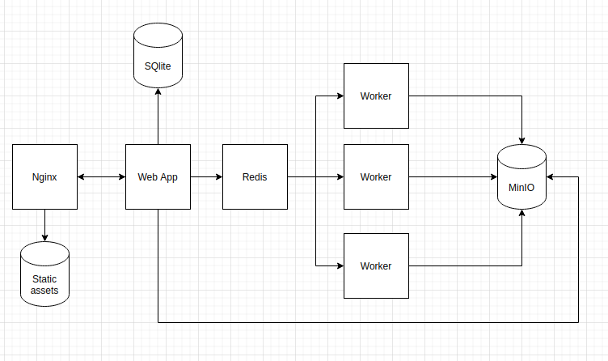

# Prospect Insight

## Description
Prospect Insight is a Django application for running lighthouse audits against three target URLs, and then providing a comparison of strictly just the overall performance score and the Lab Results data.

### Components:

* A Django application exposed on **port 80** (prospect)
* A Worker which can be scaled to process lighthouse reports. (lighthouse)
* A Nginx reverse proxy to expose the application and serve static files.
* A redis instance serving as a message queue broker.
* An object storage system minio, to store raw lighthouse reports exposed on **port 9000**
* A dashboard to help debug issues with the queue and workers exposed on **port 9181**

### Architecture 



## End Goal
Project will have the following features:
- Web interface for running a performance audit comparisons on a given prospect and two competitors URLs.
- Web interface for displaying the performance comparison.
- Web interface for viewing previously run performance audit comparisons, grouped by prospect.
- Web interface for viewing previously run performance audit comparisons for selected prospect.
- Capable of repeating the last performance audit comparison for a selected prospect.

## Usage

Create a file at the root of the project called `.env` and add the following environment variables:

* `DJANGO_SECRET_KEY` i.e `DJANGO_SECRET_KEY=mysecretkeythatwouldgetmeintroubleifinthewronghands`
* `REDIS_PORT` the default port is `6379`
* `MINIO_ACCESS_KEY` username for the minio interface
* `MINIO_SECRET_KEY` password for the minio interface
* `MINIO_URL` i.e `MINIO_URL=http://minio:9000`

Add list of make commands here.

## Test

Add how to run tests here.

### Report Object Breakdown

- A report object contains all fields from a default lighthouse json report.
- It also includes a summary which is at the core of the application.
- A report field can be accessed either using a dictionary or attribute based syntax. i.e `report[metrics]` or `report.metrics`

```python
# Partial data below, highlighting added fields
EXPECTED_DATA = {
    'finalUrl': 'https://shop.polymer-project.org/',
    'fetchTime': '2020-09-16T13:03:29.810Z',
    'performance_score': 38.0,
    'performance_class': 'low',
    'metrics': {
        'first-contentful-paint': {
            'score': 0.65,
            'timing': 1357.0, 
            'perf_class': 'medium'
        },
        'speed-index': {...},
        'largest-contentful-paint': {...},
        'interactive': {...},
        'total-blocking-time': {...},
        'cumulative-layout-shift': {...}
    }
}
```

- `report.finalUrl` - Returns the final url of the lighthouse audit. This is not necessarily the originally provided URL, as any redirects during the lighthouse auditing result in the final URL changing.
- `report.metrics` - Returns the sub metric dictionary.
- `report.performance_score` - Returns the overall audit performance score, derived from the individual weighting and timing of each metric.
- `report.metric_score(METRIC_NAME)` - Returns the performance score of an individual metric.
- `report.metric_timing(METRIC_NAME)` - Returns the metric timing recorded in milliseconds.
- `report.metric_performance_class(METRIC_NAME)` - Returns the metric performance class.

## Lighthouse Metrics Captured
The metrics stored alongside their individual score weighting used to find the overall performance score.

- **First Contenful Paint** - 15%
- **Speed Index** - 15%
- **Largest Contentful Paint** - 25%
- **Time to Interactive** - 15%
- **Total Blocking Time** - 25%
- **Cumulative Layout Shift** - 5%

## Dependencies
- Docker
- Docker-compose

## Contributing
Pull requests are welcome. For major changes, please open an issue first to discuss what you would like to change.

Please make sure to update tests as appropriate.

## License
[MIT](https://choosealicense.com/licenses/mit/)
